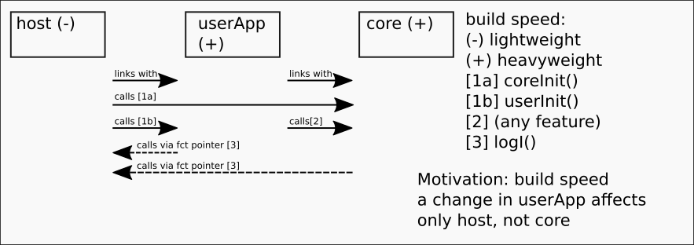

# MNOGLA
MN's OS-independent Open-GL application host

A smallest-common-denominator framework for an OS-independent openGL app. Runs on
- Windows via mingw, using GLEW.
- Linux (tested: Raspberry Pi).
- Android. Use Android Studio (tested: 2022.1.1)

### Windows (minGW) build
```pacman -S --needed base-devel mingw-w64-x86_64-toolchain
pacman -S mingw-w64-x86_64-glm
pacman -S mingw-w64-x86_64-glfw
pacman -S mingw-w64-x86_64-glew
cd host_mingw64linux
cmake -S . -B build
cmake --build build
```

### Android Studio build
SDK manager, "SDK Platforms": Install required SDK (see build.gradle)
SDK manager, "SDK Tools": Install required NDK (see build.gradle)
Click on "run app" green arrow

### Linux build
to be updated (use CMakeLists.txt, replace glew32, glfw3, opengl32 library dependencies with glfw3 and GL). 

On Android, see https://github.com/android/ndk-samples/blob/main/gles3jni/app/src/main/cpp/CMakeLists.txt for possible improvements e.g. support lower versions (code is based on older gles2ini sample)


